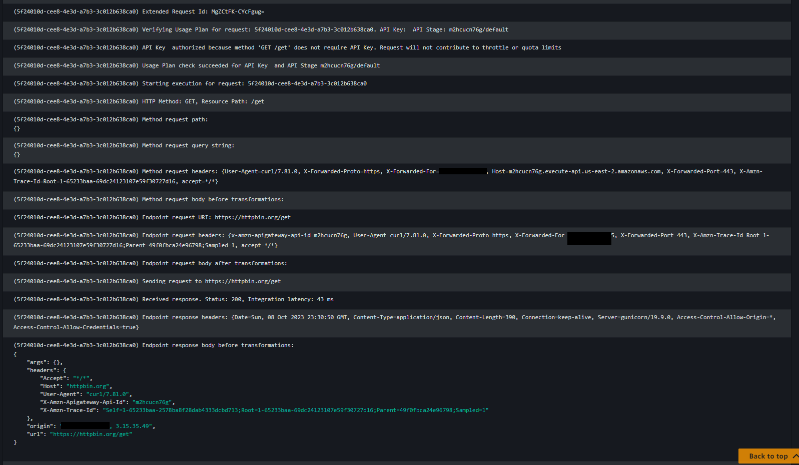
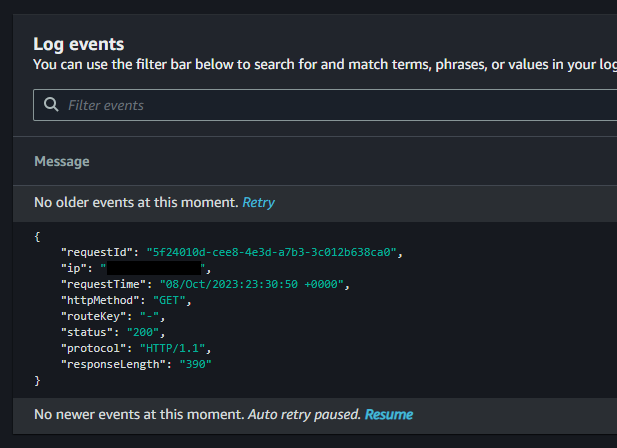

# AWS API Gateway - Monitoring and Logging

Following the [set up logging][1] documentation, there are two types of logging for API Gateway:

- **Execution logging** - CloudWatch Logs group and metrics managed by the API Gateway.
- **Access logging** - Either a CloudWatch Logs group or Kinesis Firehose destination that you manage, but you can choose only a single destination.

Check the documentation for details.

## Setup

Create your `.auto.tfvars` file from the template:

```sh
cp samples/sample.tfvars .auto.tfvars
```

The sample file has all of the logging configuration fully enabled.

Now, create the API Gateway infrastructure:

```sh
terraform init
terraform apply -auto-approve
```

The stage should have everything enabled:


## Logging

We can see that the execution logs can be extremely detailed.

With Detained Metrics enabled, additional performance data will be generated to CloudWatch metrics.

> Each method will generate these metrics: API calls, Latency, Integration latency, 400 errors, and 500 errors.



Access logs are more specific, although you can configure it via the [`$context`] variables.

Enabling access logs can used by developers to identify access patterns in combination with CloudWatch Logs Insights without the need of parsing logs.



[1]: https://docs.aws.amazon.com/apigateway/latest/developerguide/set-up-logging.html#set-up-access-logging-permissions
[2]: https://docs.aws.amazon.com/apigateway/latest/developerguide/api-gateway-mapping-template-reference.html#context-variable-reference
